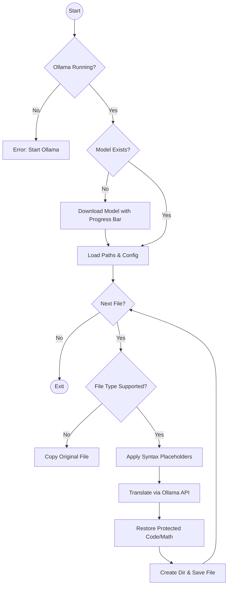

<h1 align="center">
OpenTrans
</h1>

<p align="center">
    <a href="https://rainstorm108.github.io/OpenTrans/"></a>
    
    <a href="https://github.com/RainStorm108/OpenTrans/releases"></a>
    
    <a href="https://github.com/RainStorm108/OpenTrans"></a>
</p>

---
**Documentation:** [https://rainstorm108.github.io/OpenTrans/](https://rainstorm108.github.io/OpenTrans/)

**PyPI:** [https://pypi.org/project/opentrans/](https://pypi.org/project/opentrans/)

**Source Code:** [https://github.com/RainStorm108/OpenTrans](https://github.com/RainStorm108/OpenTrans)

---

**OpenTrans** is a privacy-first, local-LLM batch translation utility powered by Ollama. It mirrors a source directory into a target language while preserving the exact file hierarchy, making it ideal for documenting software, translating blogs, or localizing static sites.

## Key Features

* **Local-First (Ollama):** Private, cost-free translation using models like Gemma, Llama 3, or DeepSeek.
* **Syntax Shielding:** Automatically protects code blocks (```), inline code (`), LaTeX math ($), and Markdown links from being corrupted by the LLM.
* **Directory Mirroring:** Recursively replicates your source folder structure in the output destination.
* **Parallel Processing:** Uses `ThreadPoolExecutor` for high-speed batch handling of large file sets.
* **Smart Caching:** Uses hashing to track file changes. Only files that have been modified since the last run are sent to the LLM, saving significant time and compute resources.
* **Resilient File Handling:** Automatically pulls required models from Ollama with a real-time progress bar if they are missing.

## Installation

**Prerequisites**: You must have [Ollama](https://ollama.com/download) installed and running.

**Option 1: Install via PyPI (Recommended)**

```py
pip install opentrans
```

**Option 2: Install via uv**

```py
uv tool install opentrans
```

**Option 3: From Source**

```
git clone https://github.com/rainstorm108/OpenTrans.git
cd OpenTrans
uv tool install .
```

## Usage

### Basic Command
The simplest way to run OpenTrans is by specifying the input and output directories:

```bash
opentrans ./docs ./translated_docs --config ./config.yaml

```

**Example Output:**

```text
Target Language: Chinese
Input:  /home/user/Projects/OpenTrans/docs
Output: /home/user/Projects/OpenTrans/translated_docs
Using Model: translategemma:4b

Translating Files: 100%|████████████████████████████████| 12/12 [00:45<00:00, 3.7s/file]

Complete.
```

### Configuration (config.yaml)
OpenTrans relies on a YAML configuration file to define the model and target language. See [example](config.yaml).


### Running Examples

```bash
opentrans ./Example/Docusaurus/docs ./Example/Docusaurus/i18n/zh-hans/docusaurus-plugin-content-blog/current ./config.yaml    
```

## Local Development

1. Clone the repository
```bash
git clone [https://github.com/rainstorm108/OpenTrans.git](https://github.com/rainstorm108/OpenTrans.git)
cd OpenTrans
```

2. Set up the environment (using uv)

```bash
uv sync
source .venv/bin/activate
```

3. Install in editable mode

```bash
uv pip install -e .
```

4. Run tests
```bash
hatch test
```

## Project Structure

```text
OpenTrans/
├── src/
│   └── opentrans/
│       ├── __init__.py        
│       ├── main.py            # CLI interface using Click
│       ├── settings.py        # Configuration management
│       ├── translator.py      # Core translation logic
│       ├── cache_manager.py   # Caching system
│       └── hasher.py          # File content hashing
├── tests/
├── config.yaml                
├── pyproject.toml
└── README.md
```

## Workflow



## Todo

* [x] Click-based CLI interface
* [x] Placeholder-based syntax protection (Code/LaTeX)
* [x] Multi-threaded parallel processing
* [x] Implement hash caching to skip unchanged files
* [ ] Finish the Docusaurus translate script
* [ ] User Tree-sitter to replace the code blocks before translation instead of regex
* [ ] Add support for more file types
* [ ] ...

## License

This project is licensed under the MIT License.
